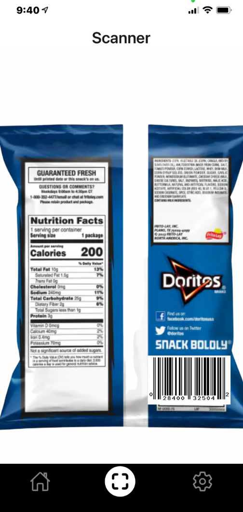
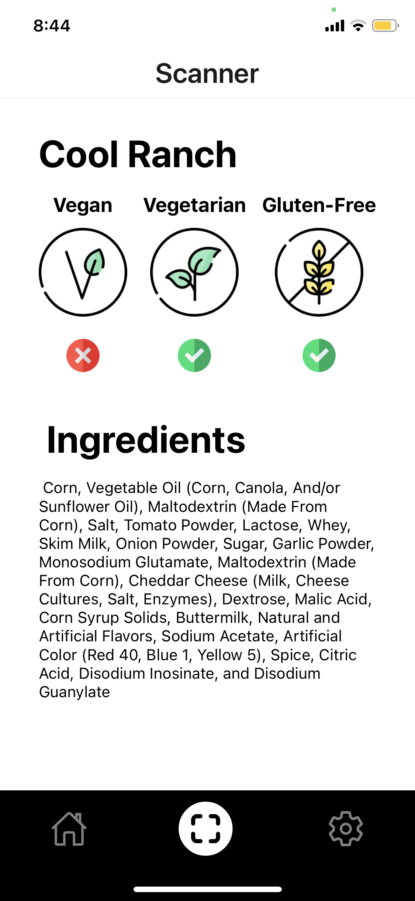

# SeeFood

  

By Albert Lai, Zaki Rangwala, and Aryaan Bhimani for Hack the North 2021.

SeeFood is a game changing app that helps people better understand what they eat and follow their diet by providing useful information about food ingredients.

## Getting Started

- Setup the Development environment : https://reactnative.dev/docs/environment-setup
- Install dependencies: `yarn install` (or `npm install`).
- Run on Android: `yarn android` (or `npm run android`).
- Run on iOS: `yarn ios` (or `npm run ios`).
- Run on Web: `yarn web` (or `npm run web`).
- **Start the Server (`expo start`)**

## Demo Application

Using Expo Client App (Expo Go) and scan this QR code:

  

## Preview

How the App should work!

### Home Screen

  

### Scan barcode of food item

### Get Ingredients and Dietary Restrictions Information

