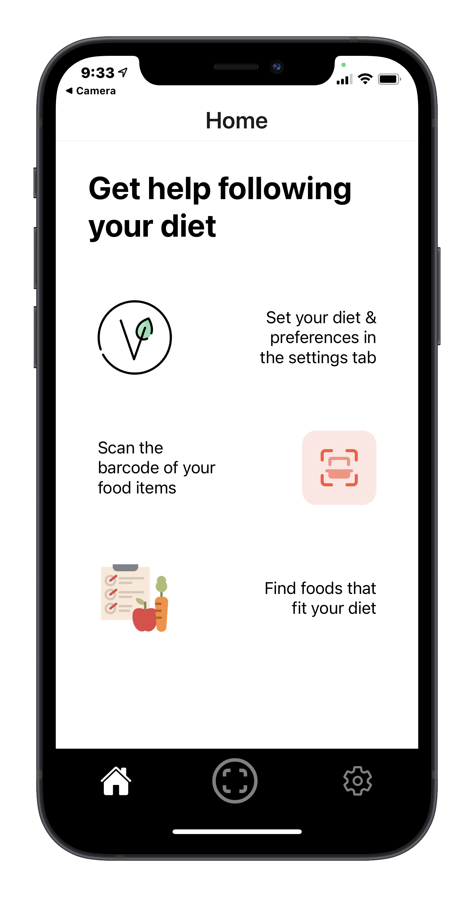
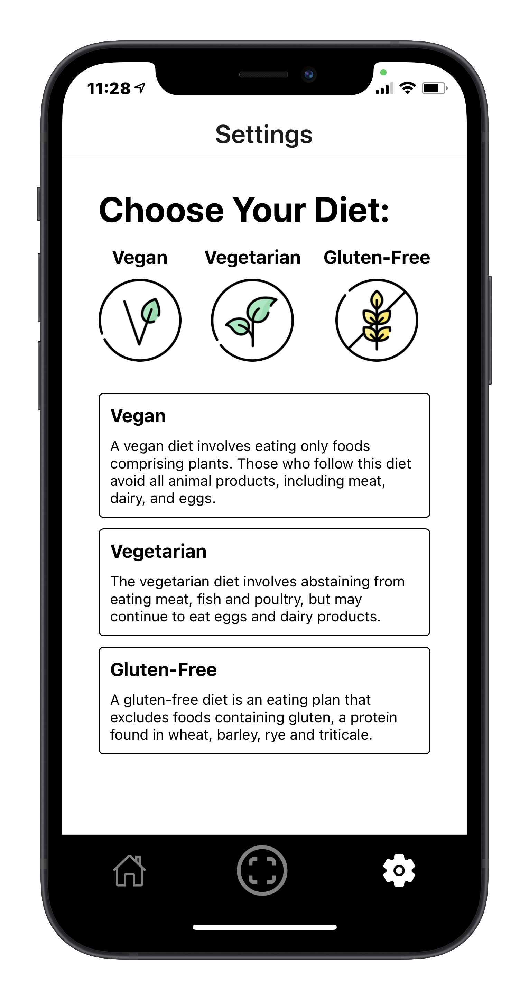
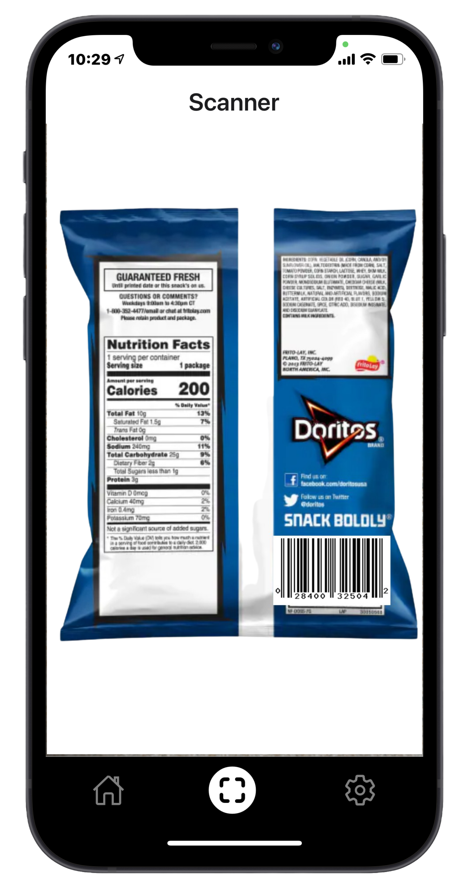
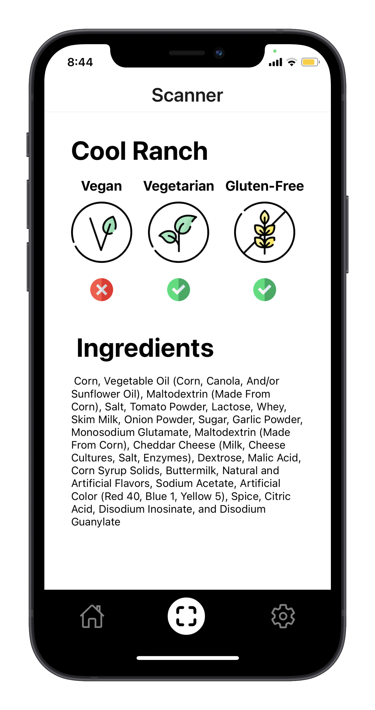

# SeeFood

  

By Albert Lai, Zaki Rangwala, and Aryaan Bhimani for Hack the North 2021.

SeeFood is a game changing app that helps people better understand what they eat and follow their diet by providing useful information about food ingredients.

## Getting Started

- Setup the Development environment : https://reactnative.dev/docs/environment-setup
- Install dependencies: `yarn install` (or `npm install`).
- Run on Android: `yarn android` (or `npm run android`).
- Run on iOS: `yarn ios` (or `npm run ios`).
- Run on Web: `yarn web` (or `npm run web`).
- **Start the Server (`expo start`)**

## Demo Application

Use the Expo Client App (Expo Go) and scan this QR code:

  

\* Note : Demo may not work on iOS devices, in that case, clone the repository (git clone https://github.com/ZakiRangwala/SeeFood.git) > install dependencies (npm i) > run server (npm start) > (scan QR code and run on expo app)

## Preview

How the App should work!

### Home Page (Learn How to Use App)

### Settings page (Select your dietary preferences)

### Camera Page (Scan Barcode of Food Item)

### Results Page (Get Ingredients and Allergens Information)

